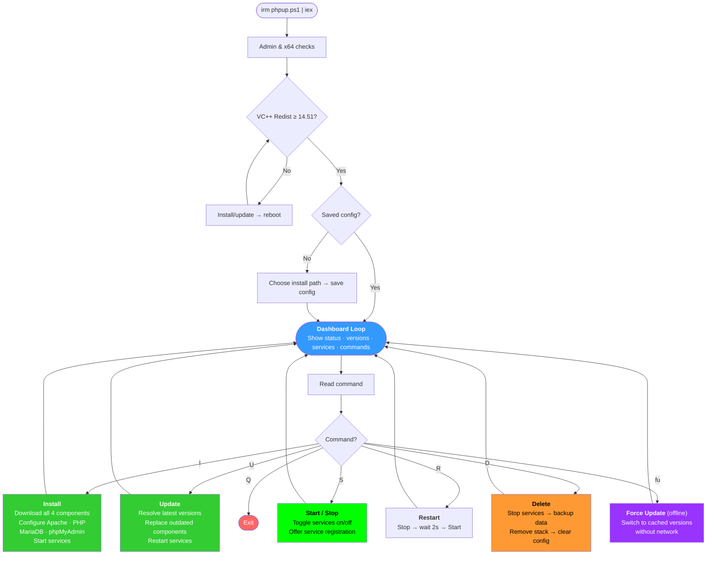

# phpup — Local PHP Web Stack. One Script. Done.

> **Inspired by** [getPHP.org](https://getphp.org)

| Platform          | Approach                                                                                      |
| ----------------- | --------------------------------------------------------------------------------------------- |
| **Windows**       | Native binary downloads, dynamic version resolution, and an interactive PowerShell dashboard. |
| **macOS & Linux** | macOS: Homebrew (Intel & Apple Silicon) — Linux: native apt packages (Debian/Ubuntu). Same dashboard experience, one bash script. |

## Quick Start

### Windows

Right-click PowerShell → Run as Administrator, then:

```powershell
irm https://raw.githubusercontent.com/DaFa66/phpup/HEAD/phpup.ps1 | iex
```

Press **I** to install. That's it.

### macOS

Open Terminal and run:

```bash
curl -fsSL https://raw.githubusercontent.com/DaFa66/phpup/HEAD/phpup.sh | bash
```

Press **I** to install. That's it.

### Linux

Open Terminal and run:

```bash
curl -fsSL https://raw.githubusercontent.com/DaFa66/phpup/HEAD/phpup.sh | bash
```

Press **I** to install. That's it.

On subsequent runs the script remembers your install path and goes straight to the dashboard — no prompts.

### PowerShell Alias (Optional)

To avoid copy-pasting the URL each time, add a function to your PowerShell profile:

1. Open your profile in Notepad: `notepad $PROFILE`
2. Add the following code, then save and restart PowerShell:

```powershell
function phpup {
    $command = "irm https://raw.githubusercontent.com/DaFa66/phpup/HEAD/phpup.ps1 | iex"

    Start-Process pwsh `
        -Verb RunAs `
        -ArgumentList "-NoProfile", "-ExecutionPolicy", "Bypass", "-Command", $command
}
```

**How it works:** typing `phpup` launches a fresh **elevated** PowerShell window (`-Verb RunAs`) that downloads and executes the script. `-NoProfile` keeps the launch clean, `-ExecutionPolicy Bypass` avoids any execution policy friction. After the UAC prompt, the dashboard appears — same as the one-liner, but now it's just `phpup`.

> **Note:** `pwsh` refers to PowerShell 7+. If you're using Windows PowerShell 5.1, replace `pwsh` with `powershell`.

## What It Installs

| Component      | Source                                                         | Latest?                                                             |
| -------------- | -------------------------------------------------------------- | ------------------------------------------------------------------- |
| **Apache**     | [Apache Lounge](https://www.apachelounge.com/download/)        | ✅ Resolves latest VS18 build dynamically                           |
| **PHP**        | [windows.php.net](https://windows.php.net/downloads/releases/) | ✅ Parses releases.json for latest 8.x TS VS17 (falls back to VS16) |
| **MariaDB**    | [mariadb.org](https://downloads.mariadb.org/rest-api/mariadb/) | ✅ Queries REST API for latest Stable (Rolling > LTS)               |
| **phpMyAdmin** | [phpmyadmin.net](https://www.phpmyadmin.net/downloads/)        | ✅ Scrapes downloads page for latest stable                         |

All installed to `C:\phpup\` by default. No system-wide changes, no cruft. Optionally register as Windows services for auto-start on boot.

## Directory Layout

```
C:\phpup\
├── apache\          # Apache Lounge (VS18, port 80)
│   ├── bin\
│   ├── conf\
│   └── ...
├── php\             # PHP 8.x thread-safe x64
│   ├── php.exe
│   ├── ext\
│   └── ...
├── mariadb\         # MariaDB
│   ├── bin\
│   ├── data\
│   └── ...
├── www\             # ← Your websites go here
│   └── phpinfo.php  # (auto-created test file)
├── phpmyadmin\      # phpMyAdmin (at stack root)
├── logs\            # All log files
│   ├── apache_error.log
│   ├── apache_access.log
│   ├── php_errors.log
│   └── mariadb_error.log
└── data_backup\     # (created on delete — databases preserved here)
```

## Dashboard Commands

After running the script, you'll see the phpup dashboard:

```
┌─────────────────────────────┐
│    ____  _   _ ____         │
│   |  _ \| | | |  _ \  /\    │
│   | |_) | |_| | |_) | || |  │
│   |  __/|  _  |  __/| || |  │
│   |_|   |_| |_|_|    ||_|   │
│         ▲ ▲ ▲               │
│         phpup               │
└─────────────────────────────┘

System Prerequisites:
~~~~~~~~~~~~~~~~~~~~~
VC++ Redist --> 14.51.36247.0

Your Web Stack:
~~~~~~~~~~~~~~~
Apache -------> 2.4.68
MariaDB ------> 12.3.2
PHP ----------> 8.5.8
phpMyAdmin ---> 5.2.3

Process Status:
~~~~~~~~~~~~~~~
Apache -------> running
MariaDB ------> running
PHP ----------> CLI available

Windows Services:
~~~~~~~~~~~~~~~~
phpup_Apache   registered
phpup_MariaDB  registered

Where to put website files? C:\phpup\www
How to test your PHP setup? http://localhost/phpinfo.php
Where to access phpMyAdmin? http://localhost/phpmyadmin
How to log into phpMyAdmin? Username: root | Password: [blank]

Stack Commands:
~~~~~~~~~~~~~~~
U  Update outdated components
R  Restart all services
S  Start / Stop services (add service registration when not installed)
D  Delete the web stack
Q  Quit
```

| Key    | Action                                                                                                                                           |
| ------ | ------------------------------------------------------------------------------------------------------------------------------------------------ |
| **I**  | Install the web stack (download + configure + start)                                                                                             |
| **U**  | Update outdated components (compares installed vs latest online versions)                                                                        |
| **fu** | _(hidden)_ Forced update — switch components to any cached version from `%TEMP%\\webstack_downloads\\` without touching the network              |
| **R**  | Restart Apache + MariaDB                                                                                                                         |
| **S**  | Toggle services: stops if running (offers to unregister if Windows services installed), starts if stopped (offers registration if not installed) |
| **D**  | Delete the web stack (preserves `www\\` files and MariaDB data)                                                                                  |
| **Q**  | Quit                                                                                                                                             |

## After Installation

| Question                    | Answer                                 |
| --------------------------- | -------------------------------------- |
| Where to put website files? | `C:\phpup\www`                         |
| How to test your PHP setup? | http://localhost/phpinfo.php           |
| Where to access phpMyAdmin? | http://localhost/phpmyadmin            |
| How to log into phpMyAdmin? | Username: `root` / Password: _(blank)_ |
| PHP from terminal?          | `php` and `mysql` added to user PATH   |

## Persistent Config

The script saves your install path and component versions to `%APPDATA%\phpup\config.json`. This means:

- **One-time path prompt** — asked only on first run; subsequent runs go straight to the dashboard
- **Version tracking** — Apache, PHP, MariaDB, and phpMyAdmin versions are recorded after each install/update
- **Service registration** — whether Apache and MariaDB are registered as Windows services is persisted between runs
- **PATH management** — the config tracks which directories were added to your user PATH
- **Reset on delete** — pressing `D` clears the config entirely, so the next run prompts for a fresh location

Example `config.json`:

```json
{
  "install_path": "C:\\phpup",
  "installed_at": "2026-06-05T20:45:00",
  "services_registered": true,
  "paths": {
    "apache": "C:\\phpup\\apache",
    "php": "C:\\phpup\\php",
    "mariadb": "C:\\phpup\\mariadb",
    "www": "C:\\phpup\\www",
    "logs": "C:\\phpup\\logs",
    "phpmyadmin": "C:\\phpup\\phpmyadmin"
  },
  "versions": {
    "apache": "2.4.67",
    "php": "8.5.7",
    "mariadb": "12.3.2",
    "phpmyadmin": "5.2.3"
  },
  "path_entries": ["C:\\phpup\\php", "C:\\phpup\\mariadb\\bin"]
}
```

## What the Installer Configures

### Apache

- Port 80, ServerName `localhost:80` (suppresses AH00558 warnings)
- DocumentRoot with `Options Indexes FollowSymLinks`
- `mod_rewrite` enabled with `AllowOverride All` — Trongate, Laravel, WordPress `.htaccess` rewrites work out of the box
- PHP module loaded from the installed PHP path
- phpMyAdmin alias at `/phpmyadmin`
- Error and access logs written to `logs/` (not `www/`)
- Stale `httpd.pid` cleaned before each start (no "unclean shutdown" warnings)
- Graceful shutdown via `httpd.exe -k stop` (force kill only as fallback)

### PHP

- **Extensions enabled:** `curl`, `fileinfo`, `gd`, `intl`, `mbstring`, `mysqli`, `openssl`, `pdo_mysql`, `pdo_sqlite`, `sodium`, `sqlite3`
- `display_errors = On` for development
- **Error logging:** `error_log = logs/php_errors.log`
- **OPCache:** Enabled with 256 MB memory, 16 MB interned strings, 20,000 files, JIT tracing with 100 MB buffer — production-ready out of the box
- **DLL compatibility:** PHP dependency DLLs (ICU, libssh2, nghttp2, etc.) are automatically copied to Apache's `bin/` to resolve extension loading warnings under Windows DLL search order
- **Added to user PATH** — `php` command works from any new terminal window

### SQLite3 DLL Fix

- VS17 PHP builds (8.5+) bundle an incompatible `libsqlite3.dll` that causes a blocking "Entry Point Not Found" popup when loading `pdo_sqlite` or `sqlite3` extensions
- The installer downloads the latest compatible `sqlite3.dll` from [sqlite.org](https://sqlite.org/) and replaces the bundled version in both the PHP root AND Apache's `bin/` directory — allowing both SQLite extensions to load cleanly

### MariaDB

- Data directory initialised with blank root password
- `my.ini` written with `log-error` → `logs/mariadb_error.log`
- Latest stable release resolved via REST API (Rolling > LTS)
- Debug-symbols-only zip excluded from download filter
- Download URL constructed directly from archive (bypasses REST API redirector)
- **Added to user PATH** — `mysql` command works from any new terminal window

### phpMyAdmin

- Auto-generated `config.inc.php` with blowfish secret, blank-password root login
- Version detected from the installed README and shown in the dashboard
- Click on `Operations` within any user database to setup `pma\_` configuration storage

## Prerequisites

- **Windows 10/11** (x64 only — Intel/AMD 64-bit; ARM64 is not supported)
- **Run as Administrator** (required for port 80 binding)
- **Visual C++ Redistributable** — Apache Lounge VS18 and MariaDB 12.x require the [VC++ Redistributable (VS 2017–2026) x64](https://learn.microsoft.com/en-us/cpp/windows/latest-supported-vc-redist?view=msvc-170), minimum version **14.51.36231**. The installer **blocks** until it's installed — checks for outdated versions and offers a one-click upgrade via winget (or direct download as fallback). A reboot may be required after upgrading from an older version.

## Delete / Reinstall — Database Safety

The delete command (`D`) preserves your data:

1. Services are stopped
2. `mariadb\data\` is moved to `data_backup\`
3. Apache, PHP, MariaDB, phpMyAdmin, and log files are removed
4. `www\` (your websites) is left untouched
5. If `data_backup\` already exists from a previous delete, it is timestamped (`data_backup_20260605_213000`) to avoid collisions

When you reinstall (`I`), the script detects the orphaned `data_backup\` and offers to restore your databases:

```
Found database backup from a previous install: C:\phpup\data_backup
Restore previous databases? [Y/n]
```

Say **yes** and your databases are moved back — MariaDB picks them up without re-initialisation.

## Windows Service Registration

During install, the script asks whether to register Apache and MariaDB as Windows services **before** starting them — avoiding any start-stop-restart cycle:

```
Install as Windows services (auto-start on boot)? [y/N]
```

Say **yes** and two services are created — `phpup_Apache` and `phpup_MariaDB` — set to auto-start. After a reboot your stack is running without opening the script. The config file records the choice so the dashboard always reflects current state.

If you skip registration during install, the **S** (Start / Stop) toggle will offer to register them on first use when services are stopped. The hint `(add service registration)` appears next to **S** in the dashboard until services are registered — then it disappears. A **Windows Services** block always appears below Process Status, showing `registered` or `not registered` for each service.

**S** works in both directions: if services are running and registered, it offers to unregister them after stopping. If they're running but not registered, it stops them and hints to press S again to register. Say yes to the unregister prompt to remove the Windows service entries and revert to process mode.

Services are automatically removed when you delete the stack (`D`).

## Zero Footprint

The `phpup.ps1` script runs entirely in-memory and never installs itself on your machine. Only the web stack is added to `C:\phpup\` if you choose to install it, plus a small config file at `%APPDATA%\phpup\config.json`. To manage services, update, or uninstall the stack, simply re-run the script at any time.

## Uninstalling

Run the script and press **D** (Delete). This removes Apache, PHP, MariaDB, and phpMyAdmin but **preserves** your website files in `www\` and your MariaDB data in `data_backup\`. PATH entries are removed and the config is cleared. To perform a complete wipe, delete the install directory and `%APPDATA%\phpup\` manually after running Delete.

## How It Resolves Latest Versions

Unlike most installers that hardcode version numbers, `phpup.ps1` dynamically resolves the latest stable version of every component every time you install or update:

- **Apache** — Scrapes the Apache Lounge download page, finds all VS## x64 zips, picks the highest VS version × Apache version combination
- **PHP** — Queries the `releases.json` API from windows.php.net, filters for PHP 8.x thread-safe x64, prefers VS17 builds over VS16
- **MariaDB** — Queries the MariaDB REST API (`/rest-api/mariadb/`), sorts stable releases by support policy (Rolling > LTS), then by version number. Constructs direct archive URL from version and filename (bypasses REST API redirector). Excludes debug-symbols-only zips.
- **phpMyAdmin** — Scrapes the phpMyAdmin downloads page, finds all stable `all-languages.zip` files (excluding snapshots), picks the highest version

## Offline Mode, Download Caching & Version Switching

Run the script with `-Offline` to skip all URL resolution and downloading:

```powershell
.\\phpup.ps1 -Offline
```

Offline mode requires four pre-downloaded zip files in `%TEMP%\webstack_downloads\` (Apache, PHP, MariaDB, phpMyAdmin) — run the script online once to populate the cache, then subsequent installs skip downloads entirely.

All downloaded files are cached permanently in `%TEMP%\webstack_downloads\`:

- Component zips (Apache, PHP, MariaDB, phpMyAdmin) — reused on re-install when the version hasn't changed
- SQLite3 DLL zip — cached and reused
- VC++ Redistributable installer (`.exe`) — cached and reused

Once you have multiple versions cached, the hidden **`fu`** (forced update) command lets you switch between them interactively without touching the network. Type `fu` at the dashboard prompt and you'll see a summary of installed vs cached versions, then choose which version to install per component — upgrades, downgrades, or snapshots. MariaDB databases are automatically backed up and restored across version changes.

## Program Flow



## Known Quirks & Fixes

### ARM64 / Snapdragon / Apple Silicon (Windows VM)

Not supported. phpup requires x64 (Intel/AMD 64-bit) — Apache Lounge and MariaDB do not provide native ARM64 Windows binaries. The script detects ARM64 at startup and exits with a clear message.

## Support & Contributions

If you run into any errors or bugs, please open an [issue](https://github.com/DaFa66/phpup/issues) or send a [pull request](https://github.com/DaFa66/phpup/pulls).

---

> **Disclaimer:** phpup is an independent, open-source tool and is not affiliated with, sponsored by, or endorsed by the PHP Group, the PHP Foundation, Apache Lounge, MariaDB Foundation, or phpMyAdmin.
