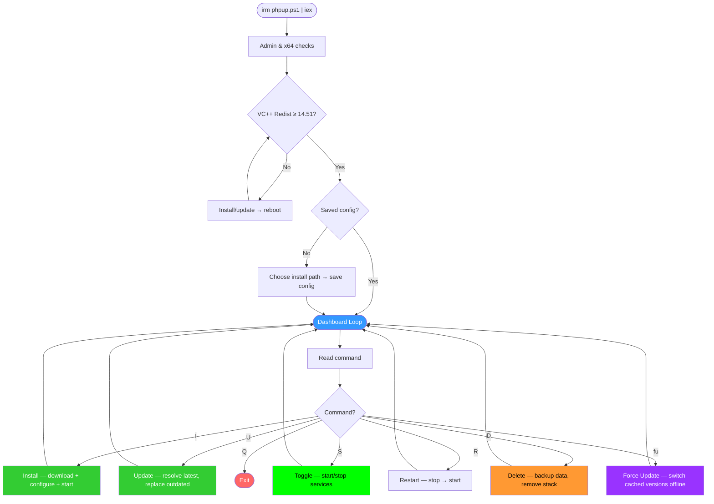

# phpup — Bare-metal PHP for local development

> Install, update and manage complete PHP development environments from a single command.

Originally inspired by getPHP, **phpup** has evolved into an independent project focused on giving developers complete control over their local PHP environment.

## Why phpup?

- Always installs the latest stable component versions
- One-command installation
- Automatic configuration
- Built-in update manager
- Offline support
- Version switching
- Optional Windows services
- Designed for developers and power users

## Platform Support

| Platform | Architecture   | Status                        |
| -------- | -------------- | ----------------------------- |
| Windows  | x64            | ✅ Stable                     |
| macOS    | x86_64 + arm64 | ⚠️ Beta                       |
| Linux    | x86_64 + arm64 | ✅ Stable (Ubuntu/Debian/WSL) |

> **macOS backend note:** Homebrew is the default on Apple Silicon and modern Intel macOS. On **older Intel Macs** (macOS 10.15 Catalina through 13 Ventura — where Homebrew is phasing out Intel support), phpup automatically switches to the **MacPorts** backend so your older hardware keeps working. You can force a choice with `PHPPUP_BACKEND=brew` or `PHPPUP_BACKEND=port`.

> **macOS version note:** macOS 11 Big Sur or newer recommended. macOS 10.x works via MacPorts but PHP compiles from source (slower, needs full Xcode CLT). Below macOS 10.15 Catalina the script prints an explicit end-of-life message — the machine is not viable for a modern web stack.

## Quick Start

### Windows

Right-click PowerShell → Run as Administrator, then:

```powershell
irm https://raw.githubusercontent.com/DaFa66/phpup/HEAD/phpup.ps1 | iex
```

### macOS

```bash
/bin/bash -c "$(curl -fsSL https://raw.githubusercontent.com/DaFa66/phpup/HEAD/phpup.sh)"
```

### Linux

```bash
if ! command -v curl &> /dev/null; then sudo apt install -y curl; fi && source <(curl -fsSL https://raw.githubusercontent.com/DaFa66/phpup/HEAD/phpup.sh)
```

> **WSL2:** Works out of the box on Ubuntu and Debian under WSL2. The script auto-configures Apache directory permissions for the home directory.
>
> **ARM:** Raspberry Pi and other ARM64 devices are supported via apt. Native ARM testing is ongoing — feedback welcome.

After launching **phpup**, press **I** to install. On subsequent runs the script remembers your setup and goes straight to the dashboard.

**Fresh installs install the latest PHP** (8.2+, currently 8.5) via the [ondrej/php repository](https://deb.sury.org/) instead of the distro default — same behaviour as Windows and macOS. Use the hidden **`fu`** command later to switch versions.

### Windows PowerShell Alias (Optional)

Add this to your PowerShell profile for a quick `phpup` command:

```powershell
function phpup {
    $command = "irm https://raw.githubusercontent.com/DaFa66/phpup/HEAD/phpup.ps1 | iex"
    Start-Process pwsh `
        -Verb RunAs `
        -ArgumentList "-NoProfile", "-ExecutionPolicy", "Bypass", "-Command", $command
}
```

> **Note:** `pwsh` is PowerShell 7+. For Windows PowerShell 5.1, replace with `powershell`.

## How Version Resolution Works

phpup doesn't hardcode version numbers. Every install and update dynamically resolves the latest stable release of each component:

| Component      | Source          | Method                                                           |
| -------------- | --------------- | ---------------------------------------------------------------- |
| **Apache**     | Apache Lounge   | Scrapes download page, picks highest VS version × Apache version |
| **PHP**        | windows.php.net | Queries `releases.json`, filters for 8.x TS x64, prefers VS17    |
| **MariaDB**    | mariadb.org     | REST API, sorts by support policy (Rolling > LTS), then version  |
| **phpMyAdmin** | phpmyadmin.net  | Scrapes downloads page for latest stable `all-languages.zip`     |

## Features

### Dashboard

```
┌─────────────────────────────┐
│    ____  _   _ ____         │
│   |  _ \| | | |  _ \  /\    │
│   | |_) | |_| | |_) | || |  │
│   |  __/|  _  |  __/| || |  │
│   |_|   |_| |_|_|    ||_|   │
│         ▲ ▲ ▲               │
│         phpup               │
└─────────────────────────────┘
```

The dashboard shows installed versions, running services, and useful paths — all in one place.

### Commands

| Key    | Action                                                                                                 |
| ------ | ------------------------------------------------------------------------------------------------------ |
| **I**  | Install the web stack                                                                                  |
| **U**  | Update outdated components                                                                             |
| **fu** | _(hidden)_ PHP version switch (offline zips on Windows, ondrej/php repo on Linux) |
| **R**  | Restart Apache + MariaDB                                                                               |
| **S**  | Toggle services — stops if running, starts if stopped. Offers service registration.                    |
| **D**  | Delete the stack (preserves `www/` and databases)                                                      |
| **Q**  | Quit                                                                                                   |

### Offline Mode & Version Switching

Run with `-Offline` to skip all network activity:

```powershell
.\phpup.ps1 -Offline
```

Requires pre-downloaded zips in `C:\phpup\downloads\`. Run the script online once to populate the cache, then all subsequent installs skip downloads entirely.

Once multiple versions are cached, the hidden **`fu`** command lets you switch between them interactively — upgrades, downgrades, or snapshots — without touching the network. MariaDB databases are automatically backed up and restored across version changes.

> **Mac & Linux:** **`fu`** switches PHP versions via package manager — Homebrew formulae (`php@8.2` … `php@8.5`) on macOS, and the [ondrej/php repository](https://deb.sury.org/) on Debian/Ubuntu (8.2 → latest). Select the version from a numbered list; the previous PHP version stays installed so you can switch back anytime.

### Service Registration (Windows)

During install, you're prompted to register Apache and MariaDB as Windows services for auto-start on boot. If you skip it, the **S** toggle will offer registration later. Services are named `phpup_Apache` and `phpup_MariaDB`. The dashboard shows current registration state and the **S** command works in both directions — it can also unregister services when they're no longer needed.

### Safe Delete

Pressing **D** stops services, backs up your config files (`httpd.conf`, `php.ini`, `my.ini`, `config.inc.php`) to `config_backup/` and MariaDB data to `data_backup/`, then removes Apache, PHP, MariaDB, and phpMyAdmin. Your website files in `www/` are untouched.

On reinstall, the script detects both backups and offers to restore your databases and config files — MariaDB picks up the restored data without re-initialisation, and your Apache, PHP, and phpMyAdmin settings are preserved.

> **Mac & Linux (apt/brew/port):** config files live in `/etc` (apt), the Cellar (brew), or `/opt/local/etc` (MacPorts) and are **kept in place** by the package manager — no `config_backup/` needed. Delete removes packages and runtime state, preserves `www/`, `data_backup/`, and the package manager's config dir; reinstall re-applies them automatically.

## What the Installer Configures

### Components

| Component      | Source                                                         |
| -------------- | -------------------------------------------------------------- |
| **Apache**     | [Apache Lounge](https://www.apachelounge.com/download/)        |
| **PHP**        | [windows.php.net](https://windows.php.net/downloads/releases/) |
| **MariaDB**    | [mariadb.org](https://downloads.mariadb.org/rest-api/mariadb/) |
| **phpMyAdmin** | [phpmyadmin.net](https://www.phpmyadmin.net/downloads/)        |

All components installed to `C:\phpup\` by default.

### Directory Layout

```
C:\phpup\
├── apache\          # Apache Lounge (VS18, port 80)
├── php\             # PHP 8.x thread-safe x64
├── mariadb\         # MariaDB
├── www\             # ← Your websites go here
│   └── phpinfo.php  # (auto-created test file)
├── phpmyadmin\      # phpMyAdmin (at stack root)
├── downloads\       # Cached component zips
├── logs\            # All log files
│   ├── apache_error.log
│   ├── apache_access.log
│   ├── php_errors.log
│   └── mariadb_error.log
├── data_backup\     # (created on delete — databases preserved)
└── config_backup\    # (created on delete — config files preserved)
```

### Apache

- Port 80, ServerName `localhost:80`
- DocumentRoot with `Options Indexes FollowSymLinks`
- `mod_rewrite` enabled with `AllowOverride All` — `.htaccess` rewrites work out of the box
- PHP module loaded automatically
- phpMyAdmin alias at `/phpmyadmin`
- Error and access logs written to `logs/`

### PHP

- **Extensions:** `curl`, `fileinfo`, `gd`, `intl`, `mbstring`, `mysqli`, `openssl`, `pdo_mysql`, `pdo_sqlite`, `sodium`, `sqlite3`
- `display_errors = On`
- Error log routed to `logs/php_errors.log`
- OPCache enabled with 256 MB memory, JIT tracing, 100 MB buffer
- PHP dependency DLLs copied to Apache `bin/` for clean extension loading
- Added to user PATH

#### SQLite3 DLL Fix

VS17 PHP builds bundle an incompatible `libsqlite3.dll` that causes "Entry Point Not Found" popups. The installer downloads a compatible DLL from [sqlite.org](https://sqlite.org/) and replaces it in both the PHP root and Apache `bin/`.

### MariaDB

- Data directory initialized with blank root password
- `my.ini` with error log routed to `logs/mariadb_error.log`
- Latest stable release resolved via REST API
- Added to user PATH

### phpMyAdmin

- Auto-generated `config.inc.php` with blowfish secret and blank-password root login
- Version check disabled (no phoning home on login)
- 4-hour session timeout
- Template cache directory configured
- Configuration storage database (`pma`) with bookmark, history, and designer support

## After Installation

| Question                    | Answer                                 |
| --------------------------- | -------------------------------------- |
| Where to put website files? | `C:\phpup\www`                         |
| Test your PHP setup?        | http://localhost/phpinfo.php           |
| Access phpMyAdmin?          | http://localhost/phpmyadmin            |
| Login to phpMyAdmin?        | Username: `root` / Password: _(blank)_ |
| PHP from terminal?          | `php` and `mysql` available in PATH    |

## Persistent Config

The script saves state to `%APPDATA%\phpup\config.json`:

- **Install path** — prompted once, remembered thereafter
- **Component versions** — tracked after each install/update
- **Service registration state** — persisted between runs
- **PATH entries** — tracked for clean uninstall

Example:

```json
{
  "install_path": "C:\\phpup",
  "installed_at": "2026-06-05T20:45:00",
  "services_registered": true,
  "versions": {
    "apache": "2.4.67",
    "php": "8.5.7",
    "mariadb": "12.3.2",
    "phpmyadmin": "5.2.3"
  }
}
```

Config is cleared when you delete the stack. The next run prompts for a fresh install path.

## Prerequisites

- **Windows 10/11** (x64 only — Intel/AMD 64-bit)
- **Run as Administrator** (required for port 80)
- **Visual C++ Redistributable** — [VC++ 2015–2022 x64](https://learn.microsoft.com/en-us/cpp/windows/latest-supported-vc-redist?view=msvc-170), minimum version 14.51.36231. The installer checks on startup and offers a one-click upgrade if needed.

### macOS

- **macOS 11 Big Sur+** recommended. macOS 10.15 Catalina supported via MacPorts (source builds — slower).
- **Xcode Command Line Tools** — prompted to install automatically if missing (`xcode-select --install`).
- **Homebrew** (Apple Silicon / modern Intel) or **MacPorts** (older Intel) — installed automatically if missing.

#### Intel Macs & the Homebrew phase-out

Homebrew is phasing out Intel macOS support: Intel moves to Tier 3 (no new bottles, source-compile only) in September 2026 and becomes fully unsupported in September 2027. phpup handles this automatically:

- **Apple Silicon** — always uses Homebrew
- **Intel macOS 14+ (Sonoma/Sequoia/Tahoe)** — uses Homebrew while supported
- **Intel macOS 11–13 (Big Sur–Ventura)** — uses MacPorts (or keeps Homebrew if you already have a working brew stack — never silently migrated)
- **Intel macOS 10.15 Catalina** — uses MacPorts (the key target for older hardware)
- **Below Catalina** — explicit end-of-life message; not viable for a modern web stack

MacPorts installs everything from source (no pre-built bottles), so first installs on older hardware can take a while. PHP version switching (`fu`) works via `port select --set php`.

## Uninstalling

Press **D** to delete the stack. Your website files in `www/` and databases in `data_backup/` are preserved. PATH entries are removed and config is cleared.

For a complete wipe, delete `C:\phpup\` and `%APPDATA%\phpup\` manually after running Delete.

## Program Flow


```mermaid
flowchart TD
    START(["irm phpup.ps1 | iex"]) --> GUARDS["Admin & x64 checks"]
    GUARDS --> VC{"VC++ Redist ≥ 14.51?"}
    VC -->|"No"| VC_FIX["Install/update → reboot"]
    VC_FIX --> VC
    VC -->|"Yes"| CONFIG{"Saved config?"}
    CONFIG -->|"Yes"| DASHBOARD
    CONFIG -->|"No"| PROMPT["Choose install path → save config"]
    PROMPT --> DASHBOARD

    DASHBOARD(["Dashboard Loop"])
    DASHBOARD --> INPUT["Read command"]

    INPUT --> CMD{"Command?"}
    CMD -->|"I"| INSTALL["Install — download + configure + start"]
    CMD -->|"U"| UPDATE["Update — resolve latest, replace outdated"]
    CMD -->|"S"| TOGGLE["Toggle — start/stop services"]
    CMD -->|"R"| RESTART["Restart — stop → start"]
    CMD -->|"D"| DELETE["Delete — backup data, remove stack"]
    CMD -->|"Q"| QUIT(["Exit"])
    CMD -->|"fu"| FORCE["Force Update — switch cached versions offline"]

    INSTALL --> DASHBOARD
    UPDATE --> DASHBOARD
    TOGGLE --> DASHBOARD
    RESTART --> DASHBOARD
    DELETE --> DASHBOARD
    FORCE --> DASHBOARD

    style DASHBOARD fill:#39f,color:#fff
    style INSTALL fill:#3c3,color:#fff
    style UPDATE fill:#3c3,color:#fff
    style TOGGLE fill:#0f0,color:#000
    style DELETE fill:#f93,color:#000
    style FORCE fill:#93f,color:#fff
    style QUIT fill:#f66,color:#fff
```

## Known Limitations

- **Windows ARM64 not supported.** Apache Lounge and MariaDB do not provide native ARM64 Windows binaries. The script detects ARM64 at startup and exits.

## Support

Open an [issue](https://github.com/DaFa66/phpup/issues) or submit a [pull request](https://github.com/DaFa66/phpup/pulls).

---

> **Disclaimer:** phpup is an independent, open-source tool and is not affiliated with, sponsored by, or endorsed by the PHP Group, the PHP Foundation, Apache Lounge, MariaDB Foundation, or phpMyAdmin.
