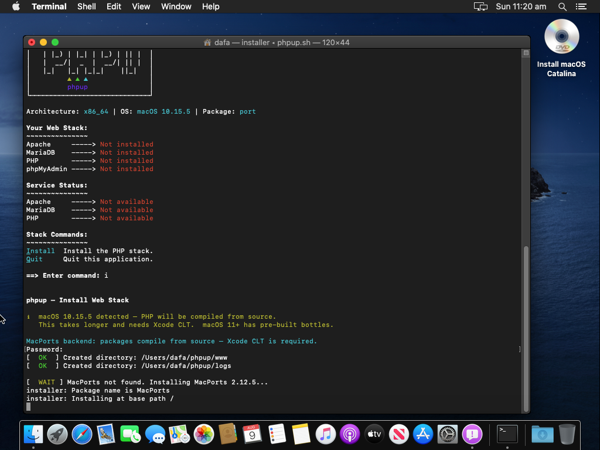
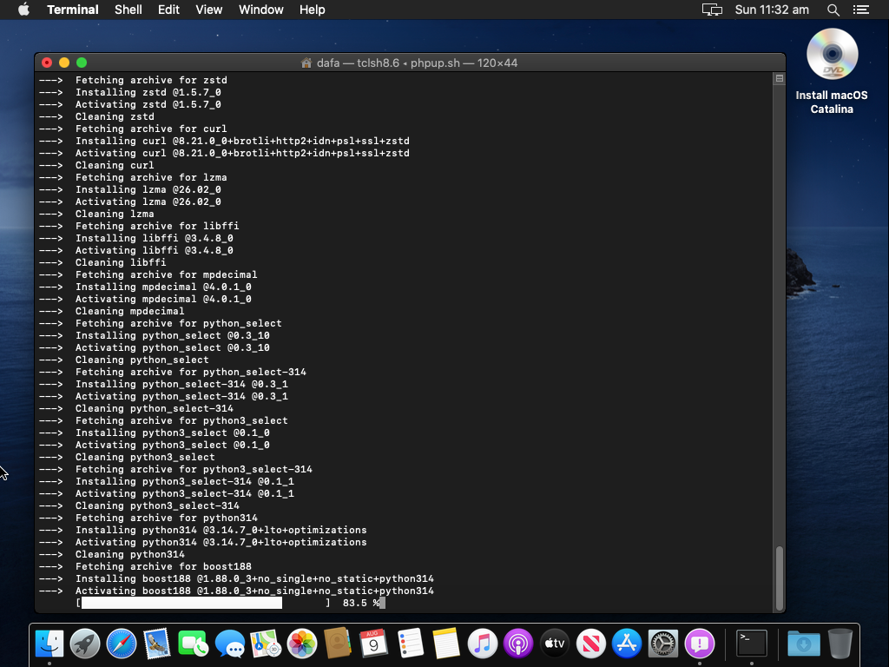
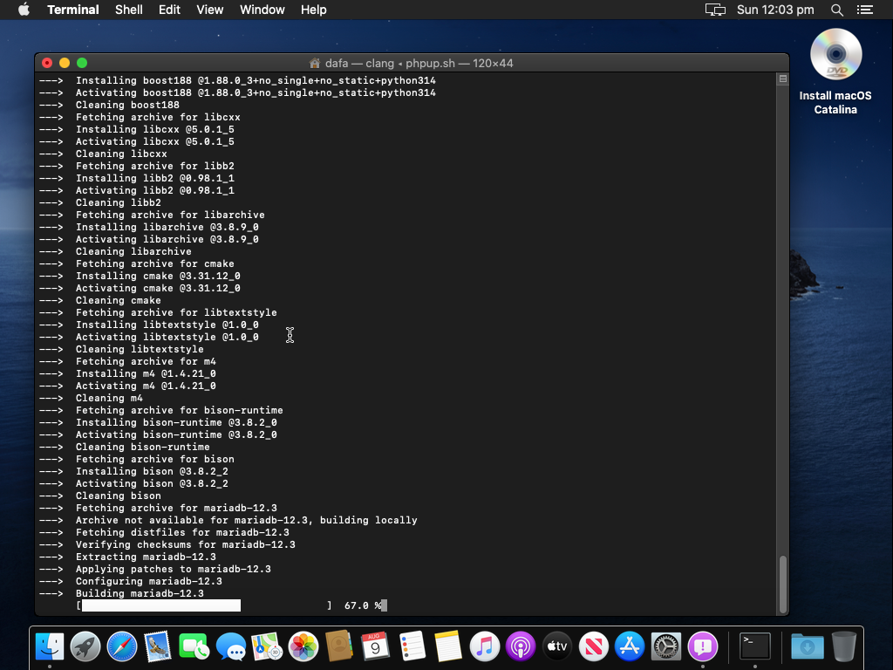
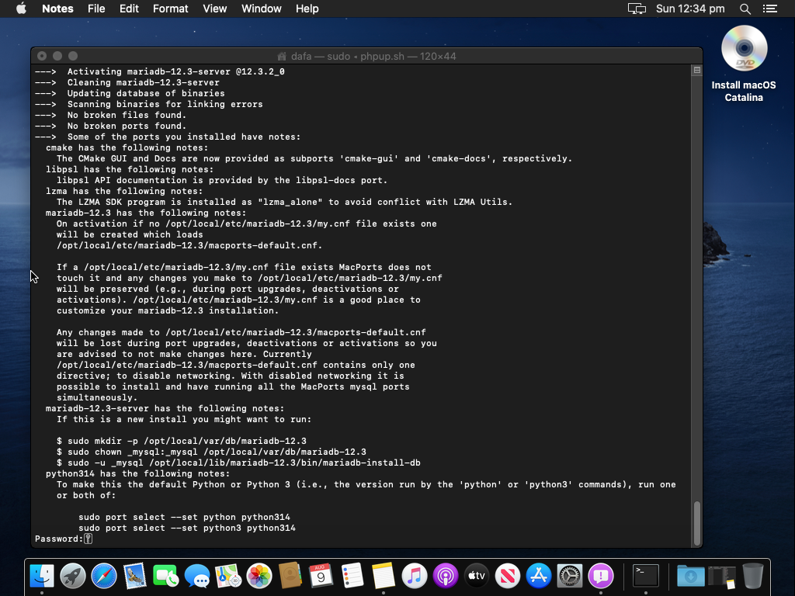
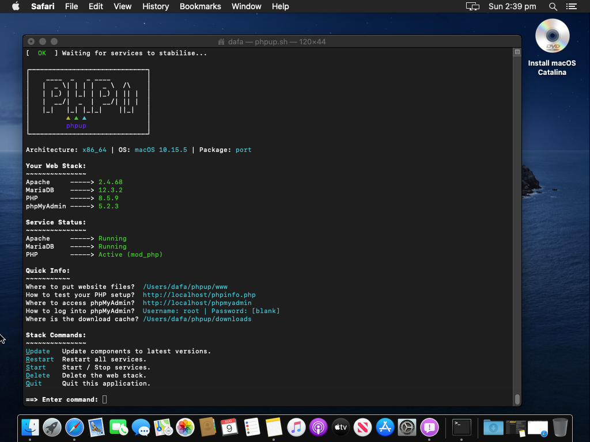
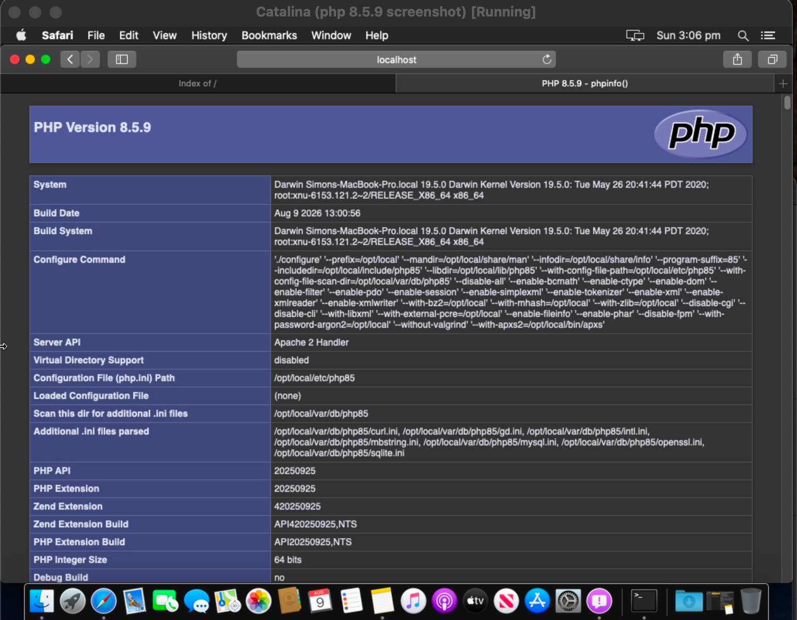

# Installing phpup on an Older Mac (macOS 10.15 Catalina – 13 Ventura)

> This guide walks you through installing the full PHP web stack on an **Intel
> Mac that Homebrew no longer supports**. phpup automatically detects this and
> uses the **MacPorts** backend, which still supports older macOS versions.
>
> You will end up with: **Apache + PHP + MariaDB + phpMyAdmin**, all configured
> and working together — exactly what you'd get on a modern Mac.

## What you need

- An Intel Mac running macOS 10.15 Catalina or newer (up to macOS 13 Ventura)
- An internet connection
- About 30–60 minutes of patience for your first install (PHP is compiled from
  source on older macOS — see [Why is it slow?](#why-is-it-slow))

> **What is MacPorts?** [MacPorts](https://www.macports.org/) is a package manager
> for macOS that still supports older Intel Macs. phpup uses it automatically when
> Homebrew isn't available — you don't need to install it yourself.

> **Before macOS 10.15?** phpup prints a clear message that your machine is not
> viable for a modern web stack. The script stops there rather than leaving you
> with a half-installed mess.

## Step 1 — Open Terminal

1. Press **Cmd + Space** to open Spotlight
2. Type **Terminal** and press Enter

## Step 2 — Install the Xcode Command Line Tools (one-time)

On older macOS, phpup needs Apple's **Command Line Tools** to compile PHP. If
they aren't installed yet, phpup will offer to install them for you:

```bash
xcode-select --install
```

A window pops up — click **Install**, then **Agree** to the license. This can
take a few minutes. phpup **waits and re-checks** that the tools finished
installing before it proceeds, so you can't accidentally break the install.

> Already have them? Nothing to do — phpup skips this automatically.

## Step 3 — Download and run phpup

In Terminal, run:

```bash
/bin/bash -c "$(curl -fsSL https://raw.githubusercontent.com/DaFa66/phpup/HEAD/phpup.sh)"
```

Or, if you downloaded the script:

```bash
bash phpup.sh
```

You'll see the phpup dashboard:

```
Architecture: x86_64 | OS: macOS 10.15.5 | Package: port

Your Web Stack:
  Apache    > Not installed
  MariaDB   > Not installed
  PHP       > Not installed
  phpMyAdmin > Not installed
```

The **`Package: port`** line tells you phpup correctly chose MacPorts for your
older Mac. Press **I** to install.

## Step 4 — Install the stack (press I)

phpup will:

1. Show a note that PHP will be **compiled from source** on macOS 10.x
2. Install **MacPorts** (the package manager for older macOS) if needed

   

3. Ask for your **password** — this is normal; phpup uses it for
   administrator tasks like installing to `/opt/local`. Type it and press Enter.
4. Download and install all the components. You'll see MacPorts messages like:

   

   The order and the slow parts are not what you'd guess — on the Catalina VM
   test the actual timings were:

   | Stage | What happens | Time on the test VM |
   | ----- | ------------ | ------------------- |
   | 1 | Apache installs first (deps: apr, expat, openssl, libxml2…) | ~10 min |
   | 2 | **MariaDB compiles from source** — the long one. Its dependency chain (perl, cmake, boost, bison…) builds first, then mariadbd itself. This is the `make` phase that runs for close to an hour. | **~1 hour** |
   | 3 | PHP installs *after* MariaDB, mostly from pre-built archives — noticeably faster | ~25–30 min |
   | 4 | PHP extensions (gd, intl, mbstring, mysql, openssl…) + phpMyAdmin | ~15 min |

   Here's MariaDB actually compiling — the long stage:

   

   And being activated once the build finished:

   

> **First time?** The download is large and the compile takes a while. On a
> 2012-era Mac expect roughly 1–4 hours. Grab a coffee. Every later run is
> much faster because MacPorts **caches** compiled packages.

## Step 5 — Check it worked

When phpup returns to its dashboard, every component should show a version:



Test PHP in your browser — visit:

```
http://localhost/phpinfo.php
```

Your browser should show the **phpinfo** page — the big PHP version and
configuration table that proves PHP is running inside Apache:



## Step 6 — Log into phpMyAdmin

Open:

```
http://localhost/phpmyadmin
```

Log in with:

| Field    | Value          |
| -------- | -------------- |
| Username | `root`         |
| Password | *(leave blank)* |

You're in — you can now create databases, run SQL, and manage your local
MariaDB server from the browser.

## Where things live

| What              | Where                                        |
| ----------------- | -------------------------------------------- |
| Your website files | `~/phpup/www`                               |
| Logs              | `~/phpup/logs` (Apache) and `/opt/local/var/log/mariadb-12.3` (MariaDB) |
| phpMyAdmin        | `http://localhost/phpmyadmin`               |
| PHP test page     | `http://localhost/phpinfo.php`              |

## Everyday commands

Back in phpup's dashboard:

| Key / command | What it does                                    |
| ------------- | ----------------------------------------------- |
| `R`           | Restart Apache and MariaDB                      |
| `S`           | Stop Apache and MariaDB                         |
| `U`           | Update everything                               |
| `D`           | Delete the whole stack (your website files stay)|
| `fu`          | Switch PHP version (hidden power-user command)  |

## Why is it slow?

On macOS 11 Big Sur and newer, MacPorts serves **pre-built binary packages**
— installs take minutes. On macOS 10.15 Catalina, the big components must be
**compiled from source** on your machine, which takes much longer. This is a
limitation of the older operating system itself, not phpup.

In the Catalina VM test the pattern was clear: **MariaDB was the long compile
(about an hour)**, while PHP and its extensions came largely from pre-built
archives and finished much faster. Expect your first install on an older Mac
to be dominated by the MariaDB build — that's normal. The good news: compiled
packages are **cached**, so reinstalls and version switches don't recompile.

## Troubleshooting

**"MariaDB failed to start" but it's actually running** — older phpup versions
looked for a process named `mariadbd`, but MacPorts runs it as `mysqld`. If you
see this, make sure you're on the latest phpup (the fix shipped August 2026).

**phpMyAdmin won't log in with an error about a socket** — the MariaDB socket
lives at `/opt/local/var/run/mariadb-12.3/mysqld.sock`, not where PHP defaults
look. Recent phpup forces phpMyAdmin to connect over TCP so this just works.

**Anything else** — open an issue at
[https://github.com/DaFa66/phpup/issues](https://github.com/DaFa66/phpup/issues)
with the output from your terminal.
